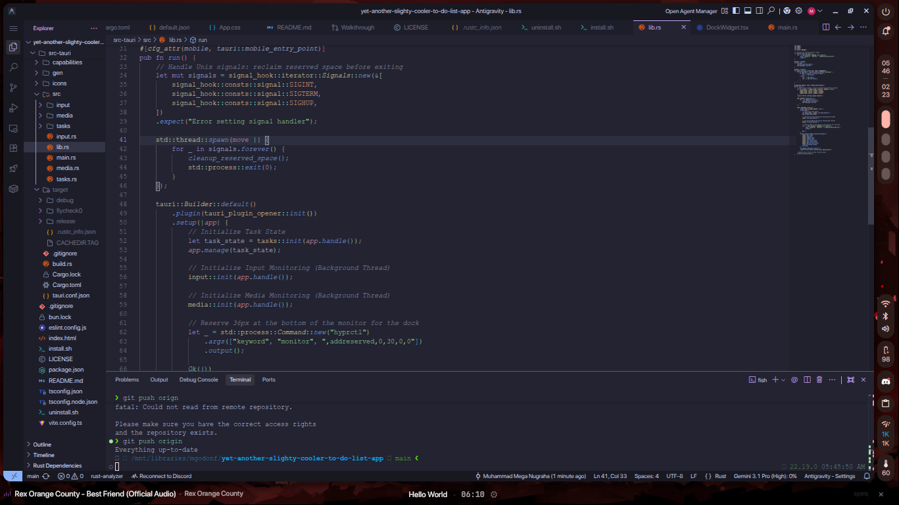

# Yet Another Slightly Cooler To-Do List App

A task widget for people who spend more time rice-ing their Linux desktop than actually being productive.




## Why I made this?

I was watching **peppy** (the osu! creator) stream and saw his Übersichts widget setup on macOS. It looked clean. Then I remembered I use Linux, Übersichts doesn't exist here, and I have a pathological need to replicate things I see on other platforms just to prove I can. So I vibe-coded this.

## What This Actually Is

It's a collection of four transparent Tauri windows that I've carefully aligned to pretend they're a single UI. It sits at the bottom of the screen and tries to look professional while running on a tiling window manager. I used Tauri because I wanted the "performance" of Rust mixed with the "convenience" of using a literal web browser to display 20 characters of text.

## Features

- **The Primary Bar (Task Dock)**: A slim line that sits there and reminds you of the task you're currently ignoring.
- **Keystroke Visualizer**: Shows every key you press. It's great for streams, or for realizing exactly how many times you mistype `sudo`.
- **Music Widget**: A tiny visualizer that pulses when music is playing. It doesn't actually help you listen better, but it looks like you're doing something complex.
- **Hyprland Integration**: Uses `hyprctl` to reserve 30px of monitor space so your windows don't overlap your "minimalist" bars.

## Task Management (If you can call it that)

- **Input & Activate**: Press Enter on a new task and it's immediately "active." No confirmation, just like your poor life choices.
- **Cross-Window Sync**: Changes sync instantly across the dock and settings panel, because consistency is the only thing we have left.
- **Background Persistence**: Saves to a JSON file in a background thread. Your UI won't lag, but your productivity might.
- **Emergency Exit**: There's a small `×` on the right. It nukes the app and restores your monitor layout for when you give up.

## User Interface (Questionable Aesthetics)

- **Pure Text**: No borders, no shadows, no "glassmorphism." If it looks like it's just floating there, that's because it is.
- **SF Pro Display**: I'm using Apple's font on Linux. I legally obtained them by moving files from an old MacBook I "hyphotetically" own. If you don't have them, it'll fall back to Roboto or Inter, which is fine, I guess.
- **Fade Logic**: Keystrokes fade out after 3 seconds, mimicking the lifespan of most of my New Year's resolutions.
- **Adaptive Animations**: The visualizer pulses only when music is actually playing. Modern engineering.

## Technical Choices

- **Rust Backend**: Used a systems programming language to manage a list of strings. Overkill? Probably.
- **MPRIS/zbus**: Interrogating the system bus just to find out you're listening to LoFi beats for the 8th hour in a row.
- **evdev**: Listening to `/dev/input` directly because high-level APIs weren't granular enough for my specific brand of monitoring.
- **Adaptive Polling**: The backend sleeps more when you're not playing music. We care about your CPU cycles, even if you don't.

## Hyprland Configuration

To make this look like the screenshots I'll eventually upload, add these to your `hyprland.conf`. It handles the floating, pinning, and "don't touch this" logic:

```hyprlang
# Slim dock bar at the bottom
windowrule {
  name = task-dock
  match:title = Task Dock
  float = on
  pin = on
  size = 500 30
  move = (monitor_w*0.5-250) (monitor_h-30)
  no_shadow = on
  no_anim = on
  no_blur = on
  no_shadow = on
}

windowrule {
  name = keystroke-bar
  match:title = Keystrokes
  float = on
  pin = on
  size = 500 30
  move = (monitor_w*0.5+170) (monitor_h-30)
  no_shadow = on
  no_anim = on
  no_blur = on
  no_shadow = on
}

windowrule {
  name = music-widget
  match:title = Music Widget
  float = on
  pin = on
  size = 400 30
  move = 0 (monitor_h-30)
  no_shadow = on
  no_anim = on
  no_blur = on
  no_shadow = on
}

# Settings panel
windowrule {
  name = task-settings
  match:title = Task Settings
  float = on
  pin = on
  size = 280 300
  no_shadow = on
  no_anim = on
}
```

## Dependencies

Before you run this, you'll need a few things:

### The Obvious Ones
- **Linux**: This is not going to work on Windows. Don't even try.
- **A Monitor**: At least one. Preferably turned on.
- **Electricity**: The app doesn't run on pure "vibe" alone (yet).
- **A Keyboard**: Hard to visualize keystrokes without one.
- **The Fonts**: SF Pro (or just accept Roboto/Inter like a normal person).

### The Technical Ones
- **Hyprland**: It's currently a Hyprland simp and needs `hyprctl`. If you're thinking about trying this on another window manager or (god forbid) Windows: **don't**. I'm trying to save your sanity here. Well i guess you could always fork and port it anyway but you do you, don't complain that I didn't warn you.
- **Bun**: Because `npm` was taking too long.
- **Rust/Cargo**: To compile the backend.
- **libevdev**: For the input monitoring.
- **DBus/MPRIS**: To talk to your media players.
- **webkit2gtk**: The literal web browser that renders the UI while Tauri tries to convince you it's a "native" app. (Hey at least it's not another chromium instance on top of 5 other you already have running)

## Getting Started (The Quest for Productivity)

### Prerequisites (Things you should have done already)
- [ ] Install **Bun** (the only runtime with a funny enough logo).
- [ ] Install **Rust/Cargo** (for that "systems engineer" feeling).
- [ ] Install **Hyprland** (or else you're just looking at a broken web page).

### Preparation (The "I'm totally going to do this" phase)
```bash
# 1. Fork this monument to my ego (duh)
git clone https://github.com/x1nx3r/yet-another-slighty-cooler-to-do-list-app.git

# 2. Walk into the directory of regret
cd yet-another-slighty-cooler-to-do-list-app

# 3. Install dependencies and hope nothing breaks
bun install

# 4. Fire up the dev server to see if it even works
bun tauri dev
```

**Note on Bundling**: I'm **"on Arch btw"** so I don't need `.deb` or `.rpm` packages. Bundling is disabled in `tauri.conf.json` because I prefer raw binaries. If you're on a distro that requires formal packaging, you'll have to enable those flags yourself or just use my `install.sh`.

### Commitment (The "Point of No Return")
```bash
# 5. Make the installer executable
chmod +x install.sh

# 6. Actually install it and admit you have a problem
./install.sh
```

### Regret (The "Get it off my screen" phase)
```bash
# Optional: Wipe your mistakes from existence
chmod +x uninstall.sh && ./uninstall.sh
```

## Acknowledgments
- **Tauri**: For making web-tech desktop apps slightly less embarrassing. (Well choose your devil, i don't wanna touch the abomination that is GTK or Qt just to be "native")
- **Hyprland**: For the rules that stop this from being a mess. (except for that time they decided to update their windowrule syntax and break all hyprland configs across the globe)
- **MPRIS**: For being the one standard on Linux that actually works across players. (no seriously i'm impressed by this one)
- **Bun**: For being fast (That's a lie i just like it's logo and it's funny name)

## License
**WTFPL**. Most of the code is overkill, but it's yours now. Do what the fuck you want to.

## Final Thoughts
This app is a monument to the modern developer's ability to spend 10 hours building a tool that saves 5 minutes of work. It floats, it pulses, and it tracks your keys. Whether it actually helps you finish your tasks is entirely up to you (it won't).

Made with caffeine and the unshakeable belief that the right UI will finally fix my work habits.
